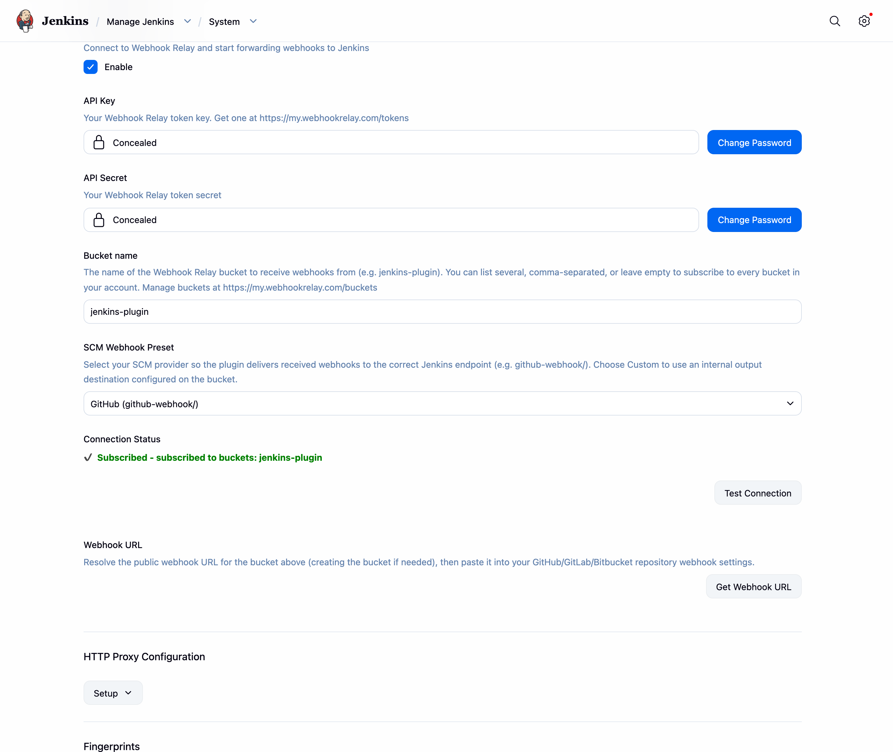
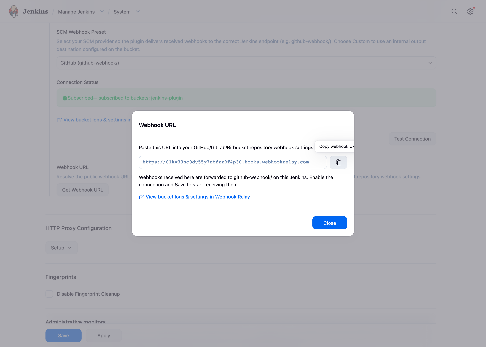
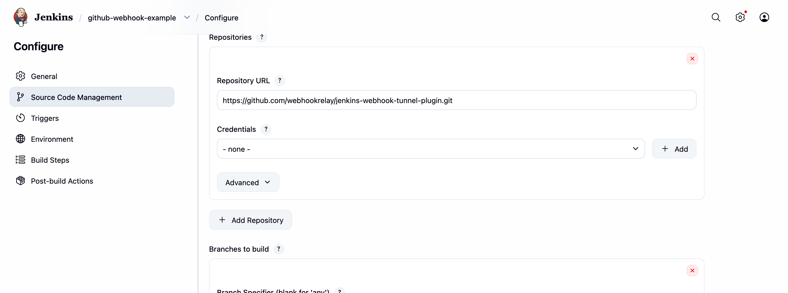
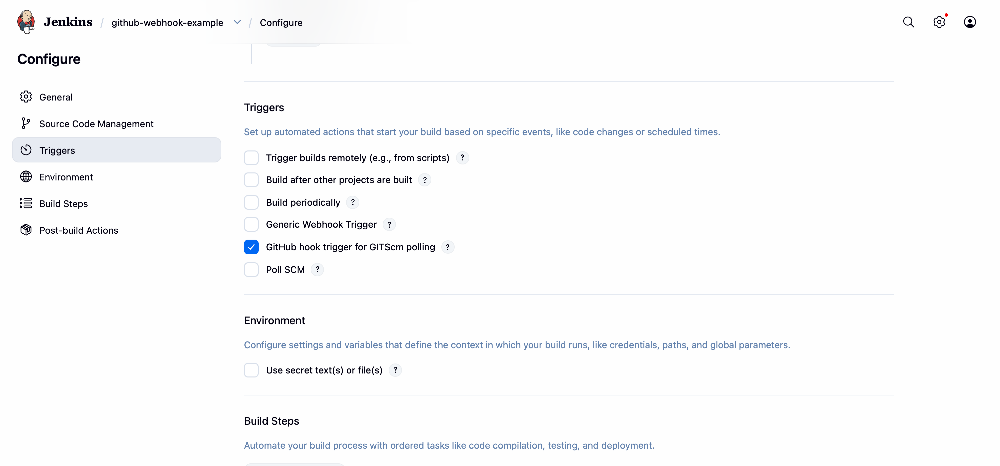
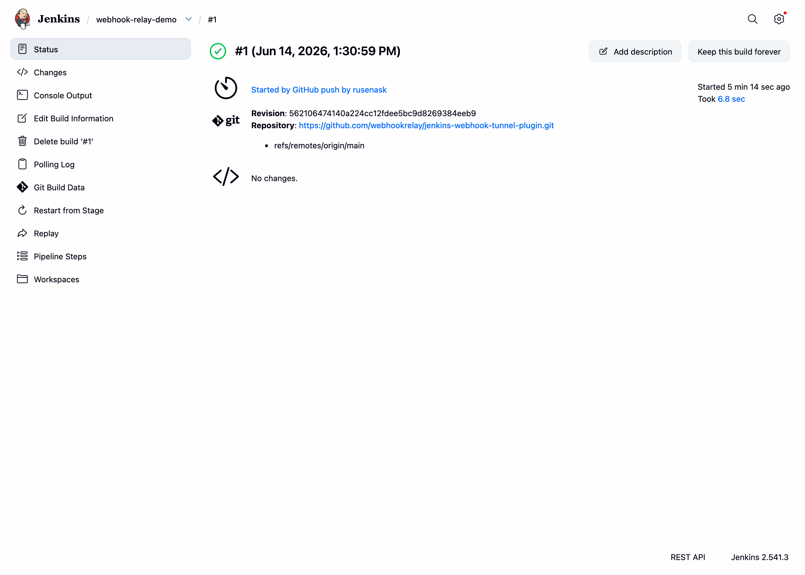
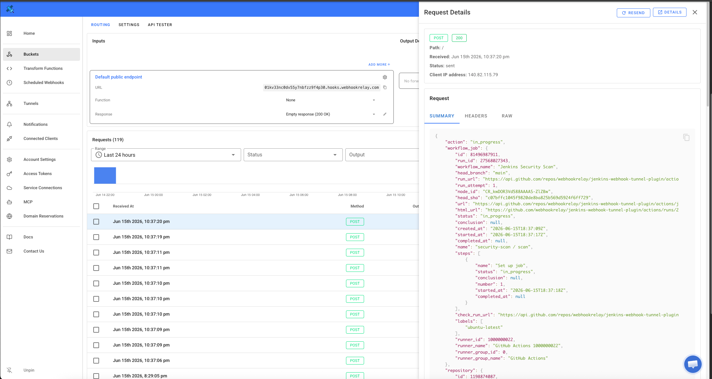

# Webhook Relay Plugin for Jenkins

Receive GitHub, GitLab, and Bitbucket webhooks in Jenkins **without exposing Jenkins to
the public internet**. The [plugin](https://webhookrelay.com/docs/tutorials/cicd/jenkins-plugin/) opens an outbound connection to a
[Webhook Relay](https://webhookrelay.com) **bucket** and forwards every webhook it receives
to the matching Jenkins endpoint (`/github-webhook/`, `/bitbucket-hook/`, …), so your SCM
can trigger builds even when Jenkins lives on a private network, behind a firewall, or on
your laptop.

Because delivery goes through a Webhook Relay **bucket** (the forwarding feature — not a
tunnel), every request is recorded on the bucket's logs page, giving you a full
request/response history for debugging.

```
GitHub / GitLab / Bitbucket
        │  (webhook)
        ▼
https://<your-bucket>.hooks.webhookrelay.com      ← public URL you paste into the SCM (GitHub, GitLab, Bitbucket)
        │
        ▼
   Webhook Relay bucket  ──────────────►  logs page (every request + Jenkins response)
        │  (outbound WebSocket, started by the plugin)
        ▼
   Jenkins  →  /github-webhook/  →  build triggered
```

## How it works

1. The plugin authenticates to Webhook Relay with your API token and **subscribes** to a
   bucket over a persistent outbound WebSocket (`wss://my.webhookrelay.com/v1/socket`). No
   inbound ports are opened on Jenkins.
2. When a webhook hits the bucket's public input URL, Webhook Relay streams it down the
   socket to the plugin.
3. The plugin replays the request against the Jenkins webhook endpoint for your SCM
   (selected via the **SCM Webhook Preset**) and sends Jenkins' response (status, headers,
   body) back to the bucket log.

## Configuration

You will need a free [Webhook Relay](https://webhookrelay.com) account and an API token
([create one here](https://my.webhookrelay.com/tokens)).

1. Go to **Manage Jenkins → System** and scroll to the **Webhook Relay** section.
2. Enter your **API Key** and **API Secret** ([get them here](https://my.webhookrelay.com/tokens)).
3. Enter a **Bucket name** (e.g. `jenkins-plugin`). It can be an existing bucket or a new
   name — the plugin creates it for you.
4. Choose your **SCM Webhook Preset** (GitHub, GitLab, Bitbucket, or Generic Webhook Trigger).
5. Tick **Enable** and click **Save**.



When connected, the **Connection Status** shows **✔ Subscribed**. Use **Test Connection**
to verify your credentials without saving.

### Get your webhook URL

Click **Get Webhook URL** to resolve the bucket's public input URL (creating the bucket if
needed). A dialog shows the URL with a copy button and a link to the bucket — paste the URL
into your repository's webhook settings.



| SCM | Where to paste the URL | Webhook content type |
|---|---|---|
| GitHub | *Settings → Webhooks → Add webhook → Payload URL* | `application/json` |
| GitLab | *Settings → Webhooks → URL* | — |
| Bitbucket | *Repository settings → Webhooks → Add webhook → URL* | — |

That's it — you don't change anything else in the SCM. Webhook Relay receives the webhook
on the public URL and the plugin forwards it to the right Jenkins endpoint.

## Triggering builds

The plugin only delivers the webhook to Jenkins — your job decides what to do with it,
exactly as it would if Jenkins were reachable from the internet. There is **no special
Webhook Relay configuration on the job**; you use the normal SCM trigger.

For a **GitHub** job (Freestyle or Pipeline):

1. Create a job: **New Item → Freestyle project** (or **Pipeline**).
2. Under **Source Code Management**, choose **Git** and set the **Repository URL** to your
   repo (add credentials if it is private):

   

3. Under **Triggers**, tick **GitHub hook trigger for GITScm polling**, then **Save**:

   

In a declarative **Pipeline** the equivalent of step 3 is a `triggers { githubPush() }` block
in the `Jenkinsfile` (see [`demo/Jenkinsfile`](demo/Jenkinsfile)).

For other providers, tick the matching trigger in the same **Triggers** section:

- **GitLab** — *Build when a change is pushed to GitLab* (GitLab plugin).
- **Bitbucket** — the Bitbucket push trigger (Bitbucket plugin).
- **Anything else** — **Generic Webhook Trigger** (shown in the screenshot above), which fires
  on any POST and needs no SCM match.

When a push arrives, the build starts — triggered by the webhook that travelled through the
bucket and the plugin (note *“Started by GitHub push”*):



## Bucket logs

Every webhook is recorded on the bucket's [logs page](https://my.webhookrelay.com/buckets),
including the response Jenkins returned. A `sent` status with a `200` response status means
Jenkins accepted the webhook. The plugin links straight to it — both in the **Get Webhook URL**
result and as a **View bucket logs &amp; settings** link under the connection status — once the
bucket has been resolved.



## Try it with Docker

A ready-to-run demo lives in [`demo/`](demo/):

```bash
mvn -q clean package                                   # builds target/webhook-relay.hpi
docker compose -f demo/docker-compose.yml up --build   # Jenkins on http://localhost:8095
```

The demo image pre-installs the `git`, `github`, `workflow-aggregator` and
`generic-webhook-trigger` plugins and an admin user via Configuration as Code. Install
`target/webhook-relay.hpi` from **Manage Jenkins → Plugins → Advanced**, then configure the
Webhook Relay section as above. See [`demo/README.md`](demo/README.md) for details.

## Configuration reference

| Field | Description |
|---|---|
| **Enable** | Connect to Webhook Relay and start forwarding. |
| **API Key / Secret** | Webhook Relay token credentials. Stored encrypted. |
| **Bucket name** | Bucket(s) to subscribe to (comma-separated). Empty = all buckets. |
| **SCM Webhook Preset** | Jenkins endpoint to deliver to: `github-webhook/`, `project/` (GitLab), `bitbucket-hook/`, `generic-webhook-trigger/invoke`, or Custom. |

> **Custom preset / internal outputs:** if you configure an *internal output* on the bucket
> with a full `http://…` destination, the plugin honours that path instead of the preset.

## Troubleshooting

| Symptom | Fix |
|---|---|
| Status shows **Authentication Failed** | Check the API key/secret. |
| Status shows **Disconnected** | The plugin reconnects automatically with backoff; check Jenkins logs. |
| Webhook arrives but no build | Make sure the job's hook trigger is enabled and (for GitHub) the Git remote URL matches the pushed repo. |
| Nothing in the bucket logs | Confirm the SCM is pointed at the bucket's public URL (the **Get Webhook URL** value). |

## Development

See [CONTRIBUTING.md](CONTRIBUTING.md) for how to build, test, and run the plugin locally.

## License

MIT. See [LICENSE](LICENSE).
